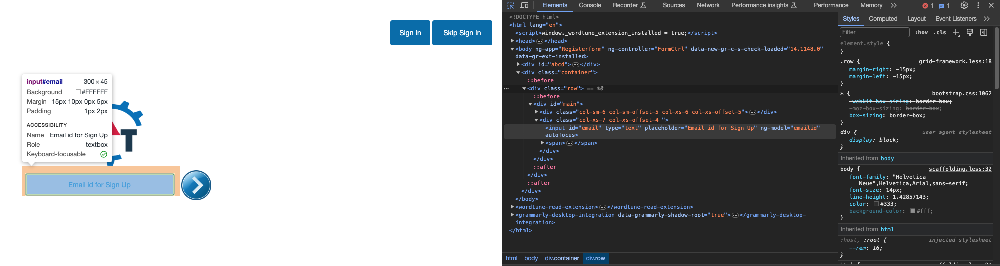
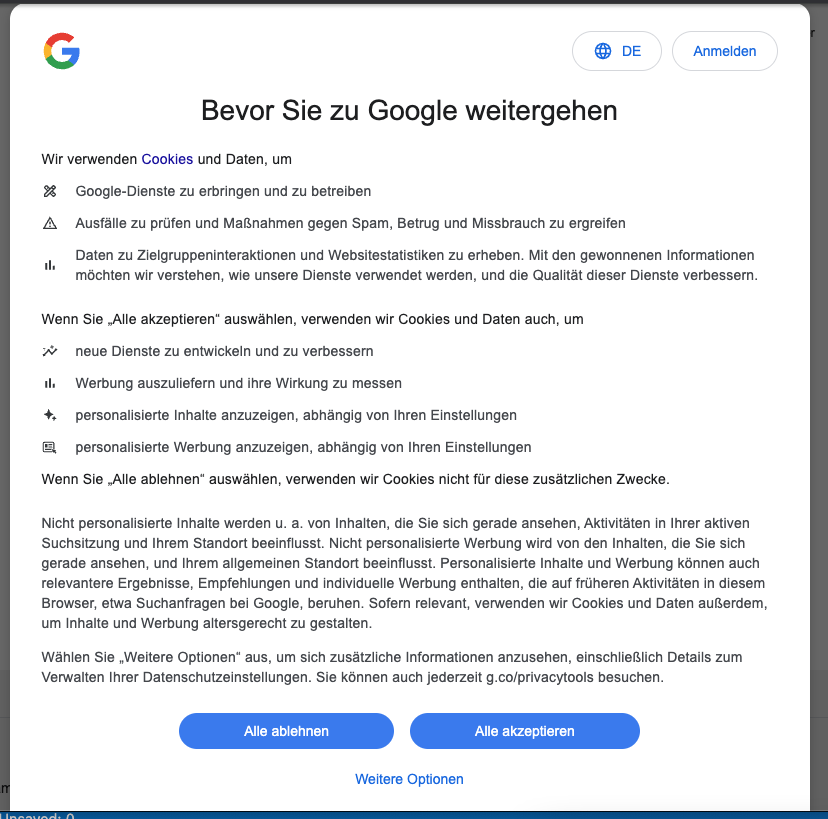

# Selenium & PyTest Automated Testing

This repository covers different aspects of automation testing as outlined in the course by [Prasanth Test Architect](https://www.youtube.com/watch?v=H9V2Af1wtgU&list=PLHT5rv7PEE4O8WXZkqCse0M3QvPHr_IlB).

## Selenium Webdriver

* Webdriver is a very popular open-source automation testing tool that supports various languages, namely, Java, JavaScript, Python, .Net, etc.
* Concepts covered:  
     * Locators : How can we locate a web element.
     * Browser Commands : Navigating back and forth between webpages.
     * Checkbox & Dropdown : How to use these elements in a webpage.
     * Waits : Async wait for web pages to load.
     * Windows Handling : Moving between windows and tabs.
     * Frames & Alerts : Handling pop-up alerts.
     * Javascript in Python script.
     * Handle Calendar for date selection.
     * Mouse and keyboard actions in a website.

## PyTest Framework

* PyTest is a simple testing framework for Python that enalbes us to group test cases in the form of modules for optimal processing.
* Concepts covered:  
    * Grouping
    * Parallel Execution
    * Fixture
    * Conftest.py file
    * Parametrize
    * HTML Reporting

* * *

* In `Selenium/locator1.py` we can retrieve data from various elements in a page by inspecting the "id" associated with a web element.  
  
* In `Selenium/locator2.py` we can access the page linked to text on the page by using `By.LINK_TEXT`.  
  

